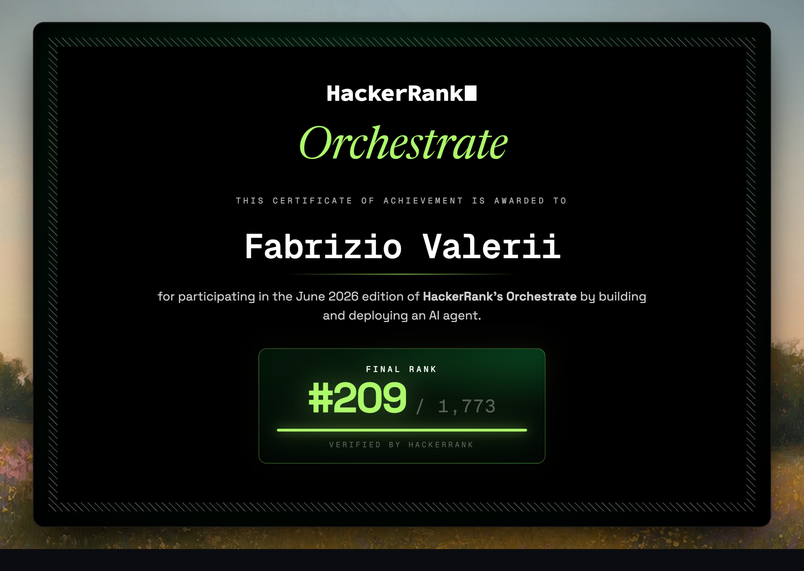

# Multi-Modal Evidence Review

**Agentic vision pipeline that verifies insurance-style damage claims from images, claim chat, and user history.**

Built for the [HackerRank Orchestrate](https://www.hackerrank.com/) 24-hour hackathon (June 2026). Designed as a production-minded system: typed schemas, safety guardrails, provider failover, deterministic post-processing, and a mocked end-to-end evaluation suite that runs offline in ~2 seconds.

| | |
|---|---|
| **Domain** | Claims / insurance evidence review (cars, laptops, packages) |
| **Stack** | Python · LangGraph · Claude / Gemini vision · Pydantic · pytest |
| **Pattern** | Agentic RAG-style graph: guardrail → route → VLM → risk / fallback |
| **Eval** | Parametrized pytest over labelled sample data + statistical report |

---

<p align="center">
  
</p>

---

## Why this project

Recruiters and hiring managers often ask: *can you ship a reliable LLM system, not just a demo prompt?* This repo is a concrete answer.

It takes messy multimodal inputs (chat transcripts, photos, user history, evidence rules) and returns a **strict, schema-valid decision** for every claim: supported / contradicted / not enough information — plus issue type, object part, severity, risk flags, and which images actually support the call.

---

## What it does

For each row in a claims CSV the system:

1. **Screens** the claim text and retrieved history with a semantic guardrail (injection, scope, relevance)
2. **Routes** by object type (`car` / `laptop` / `package`) to a specialised vision node
3. **Calls a VLM** (Claude Sonnet or Gemini Flash) with structured output + enum constraints
4. **Cross-checks** user history and evidence requirements
5. **Writes** one valid `output.csv` row — even when images fail, APIs flake, or the guardrail blocks

```text
START
  └─▶ semantic_guardrail
        ├─ block ──▶ guardrail_block_node ──▶ END
        └─ allow ──▶ evaluate_{car|laptop|package}
                        ├─ valid   ──▶ posterior_risk_node ──▶ END
                        └─ invalid ──▶ fast_fail_node      ──▶ END
```

---

## Highlights (for technical interviews)

| Capability | Implementation |
|---|---|
| **Orchestration** | LangGraph `StateGraph` with conditional edges and shared `AgentState` |
| **Safety** | Semantic guardrail (rules + optional LLM); blocks prompt injection and RAG-context poisoning; fail-open on guardrail API failure |
| **Multimodal** | Claude / Gemini vision; images downscaled before upload; provider-agnostic dispatcher |
| **Reliability** | Retry/backoff, one output row per input always, `temperature=0`, typed enums + normalisers |
| **Determinism where it helps** | Severity mapped from `issue_type`; label remaps (e.g. `glass_shatter → crack`) |
| **Evaluation** | Pytest suite with mocked LLM/VLM fixtures; answer correctness + retrieval P/R/F1; error variance and edge-case report |

---

## Tech stack

- **Python 3.12**
- **LangGraph** — stateful agent graph
- **Anthropic Claude** (default) / **Google Gemini** (fallback) — vision + structured JSON
- **Pydantic** — strict I/O and guardrail schemas
- **pandas** — CSV join of claims × history × evidence requirements
- **pytest** — offline, zero-cost regression suite

---

## Quickstart

```bash
python -m venv .venv && source .venv/bin/activate
pip install -r code/requirements.txt
cp code/.env.example .env   # set ANTHROPIC_API_KEY or GEMINI_API_KEY

# Sample run (labelled development set)
python code/main.py --claims dataset/sample_claims.csv --output output.csv

# Offline evaluation (no API calls — mocks the VLM)
pytest code/evaluation # Runs in ~2 seconds fully offline using mocked VLMs (zero API cost)
# or:  python code/evaluation/main.py
```

Keys are read from the environment only — never hardcoded. See [`code/README.md`](./code/README.md) for full run / evaluate docs.

---

## Evaluation

Two complementary layers:

1. **Pytest suite** (`code/evaluation/main.py`) — drives the real graph over `sample_claims.csv` with oracle-mocked vision. Reports strict field accuracy, retrieval precision/recall/F1, error variance, and edge-case failures → `code/evaluation/pytest_eval_report.md`.
2. **Offline scorer** (`code/evaluation/report.py`) — scores a real `output.csv` against ground truth and writes cost/latency/ops analysis → `code/evaluation/evaluation_report.md`.

On the oracle-mocked plumbing check (pipeline fidelity, not live model quality), sample-field accuracies land in the ~85–100% range depending on the field; divergences are intentional (e.g. history-derived risk flags, deterministic severity mapping). Live VLM accuracy depends on the chosen provider/model — see the generated reports after a real run.

---

## Repository layout

```text
.
├── README.md                 # Portfolio overview (this file)
├── problem_statement.md      # Original challenge I/O contract
├── AGENTS.md                 # Hackathon agent / logging rules
├── code/
│   ├── main.py               # Pipeline: guardrail, graph, vision, production loop
│   ├── README.md             # Detailed how-to
│   ├── requirements.txt
│   └── evaluation/
│       ├── main.py           # Pytest suite (mocked, offline)
│       ├── report.py         # Scorer for a real output.csv
│       └── *.md              # Generated evaluation reports
└── dataset/
    ├── sample_claims.csv     # Labels for development + tests
    ├── claims.csv            # Hold-out inputs
    ├── user_history.csv
    ├── evidence_requirements.csv
    └── images/
```

---

## Design choices worth discussing

- **Guardrail before vision** — cheap safety/scope screen before expensive multimodal calls.
- **Structured output over free text** — enum-constrained schemas so the CSV never contains illegal labels.
- **State isolation & schema hardening** — clamped hallucinated enum values before Pydantic validation to prevent silent fail-opens, and explicitly cleared checkpointer states on blocked branches to prevent data leaks between runs.
- **Deterministic severity** — grounded in `issue_type` to cut run-to-run variance.
- **Fail closed for bad evidence, fail open for guardrail outages** — never silently drop a claim row; never block all traffic because the safety LLM is down.
- **Provider abstraction** — swap Claude ↔ Gemini with config, not a rewrite.

---

## Challenge context

Built during HackerRank Orchestrate (June 2026), a solo 24-hour multi-modal evidence review challenge. Full task spec: [`problem_statement.md`](./problem_statement.md).

---

## License / notes

Dataset and starter materials belong to the challenge organisers. Solution code in `code/` is the project deliverable. Do not commit API keys; use `.env` (gitignored).
